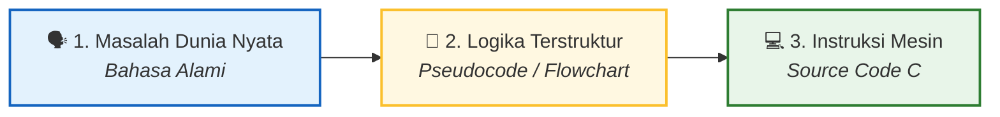

<div align="center">

# 🧠 2.2 Algoritma, Pseudocode, dan Source Code
### Bab 2: Structured Programming · Seni Berpikir Komputasional

[⬅️ Modul 2.1: Pengantar C & Variabel](01-Pengantar-C-dan-Variabel.md) &nbsp;•&nbsp; [Overview Bab 2](Bab2-Overview.md) &nbsp;•&nbsp; [Modul 2.3: Operator Aritmatika ➡️](03-Operator-Aritmatika-dan-Assignment.md)

---

</div>

## 🎯 Jangan Langsung Mengetik Kode!

Pernahkah kamu duduk di depan laptop, membuka text editor, lalu bingung harus mengetik apa? Atau langsung mengetik kode berpuluh-puluh baris, lalu program dipenuhi puluhan error yang membingungkan?

Seorang programmer profesional **tidak langsung menulis kode**. Mereka merancang solusinya terlebih dahulu. Proses transformasi dari masalah menjadi program komputer selalu melewati **tiga tahap emas**:



---

## 🔍 Perbandingan 3 Tahapan

Mari kita bedah perbedaan mendasar ketiganya dengan sebuah studi kasus sederhana: **Menentukan apakah suatu bilangan bulat adalah Genap atau Ganjil**.

| Aspek | 1. Algoritma (Bahasa Manusia) | 2. Pseudocode | 3. Source Code (Bahasa C) |
|---|---|---|---|
| **Definisi** | Langkah logis deskriptif dalam kalimat sehari-hari. | Kode semu terstruktur mendekati sintaks pemrograman. | Kode formal yang patuh 100% pada aturan sintaks compiler C. |
| **Bisa Dijalankan Komputer?** | ❌ Tidak | ❌ Tidak | ✅ Ya (setelah di-compile) |
| **Audiens Utama** | Manusia awam / konseptual. | Programmer (antar bahasa apapun). | Komputer / Compiler GCC. |
| **Contoh Kasus** | 1. Minta satu bilangan dari user.<br>2. Bagi bilangan tersebut dengan 2.<br>3. Jika sisa bagi adalah 0, maka bilangan genap.<br>4. Jika tidak, maka ganjil. | ```text<br>INPUT bilangan<br>sisa = bilangan MOD 2<br>IF sisa == 0 THEN<br>    OUTPUT "Genap"<br>ELSE<br>    OUTPUT "Ganjil"<br>ENDIF<br>``` | ```c<br>int bilangan;<br>scanf("%d", &bilangan);<br>if (bilangan % 2 == 0) {<br>    printf("Genap\n");<br>} else {<br>    printf("Ganjil\n");<br>}<br>``` |

---

## 1️⃣ Algoritma (Bahasa Alami)

**Algoritma** adalah urutan langkah-langkah logis dan berhingga untuk menyelesaikan suatu persoalan. Algoritma bersifat independen dari bahasa pemrograman apapun.

### Ciri-ciri Algoritma yang Baik:
1. **Finiteness:** Memiliki titik henti yang jelas (tidak berputar tanpa akhir).
2. **Definiteness:** Setiap langkah harus spesifik dan tidak memiliki makna ganda (tidak ambigu).
3. **Input & Output:** Menerima input nol atau lebih, dan menghasilkan minimal satu solusi output.
4. **Effectiveness:** Langkah-langkahnya realistis untuk dikerjakan.

---

## 2️⃣ Pseudocode (Kode Semu)

**Pseudocode** (*pseudo* = semu, tiruan) adalah cara menuliskan algoritma menggunakan pola bahasa terstruktur yang menyerupai bahasa pemrograman tingkat tinggi, namun tanpa aturan penulisan yang kaku (tidak perlu cemas salah titik koma atau kurung kurawal).

### Konvensi Umum Menulis Pseudocode:
- Gunakan huruf kapital untuk instruksi kendali: `INPUT`, `OUTPUT`, `IF`, `THEN`, `ELSE`, `WHILE`, `FOR`, `END`.
- Gunakan indentasi (menjorok ke dalam) untuk menunjukkan hirarki instruksi.
- Fokus pada **alur logika**, bukan detail teknis compiler.

---

## 3️⃣ Source Code (Implementasi C)

Berikut adalah implementasi penuh dari contoh kasus di atas dalam bahasa C yang siap kamu jalankan:

```c
#include <stdio.h>

int main() {
    int bilangan;

    printf("Masukkan sebuah bilangan bulat: ");
    scanf("%d", &bilangan);

    // Operator modulo (%) menghasilkan sisa pembagian bulat
    if (bilangan % 2 == 0) {
        printf("Bilangan %d adalah GENAP!\n", bilangan);
    } else {
        printf("Bilangan %d adalah GANJIL!\n", bilangan);
    }

    return 0;
}
```

> [!TIP]
> **Mengapa Memisahkan Pseudocode dan Source Code Sangat Berharga?**
> Memperbaiki kesalahan logika pada secarik kertas pseudocode hanya butuh coretan pulpen (memakan waktu beberapa detik). Namun, mendiagnosis bug logika yang terlanjur tertulis di ratusan baris kode C bisa memakan waktu berjam-jam!

---

## 🥊 Latihan Praktis Mandiri

Uji kemampuan pemikiran komputasionalmu dengan studi kasus di bawah ini:

### Studi Kasus: Kasir Diskon Swalayan
> **Ketentuan Toko:**
> Sebuah swalayan memberikan diskon sebesar **10%** bagi pelanggan yang total belanjanya mencapai **Rp 100.000 atau lebih**. Jika total belanja di bawah nominal tersebut, maka tidak mendapat diskon (diskon 0%).

Coba buat **Pseudocode**-nya di buku catatanmu terlebih dahulu, baru buka kunci di bawah ini!

<details>
<summary>🔍 <b>Klik untuk Melihat Contoh Pseudocode yang Rapi</b></summary>

```text
PROGRAM HitungDiskonSwalayan

DEKLARASI:
    totalBelanja, diskon, totalBayar : Float

ALGORITMA:
    INPUT totalBelanja

    IF totalBelanja >= 100000 THEN
        diskon = 0.10 * totalBelanja
    ELSE
        diskon = 0
    ENDIF

    totalBayar = totalBelanja - diskon

    OUTPUT "Total Diskon: Rp ", diskon
    OUTPUT "Yang Harus Dibayar: Rp ", totalBayar
```
</details>

<details>
<summary>💻 <b>Klik untuk Melihat Implementasi Source Code C</b></summary>

```c
#include <stdio.h>

int main() {
    float totalBelanja, diskon, totalBayar;

    printf("Masukkan total belanja Anda: Rp ");
    scanf("%f", &totalBelanja);

    if (totalBelanja >= 100000) {
        diskon = 0.10f * totalBelanja;
    } else {
        diskon = 0.0f;
    }

    totalBayar = totalBelanja - diskon;

    printf("\n--- RINCIAN PEMBAYARAN ---\n");
    printf("Total Belanja : Rp %.2f\n", totalBelanja);
    printf("Potongan Diskon: Rp %.2f\n", diskon);
    printf("Total Akhir   : Rp %.2f\n", totalBayar);

    return 0;
}
```
</details>

---

<div align="center">

[⬅️ Sebelumnya: Pengantar C & Variabel](01-Pengantar-C-dan-Variabel.md) &nbsp;&nbsp;|&nbsp;&nbsp; [Lanjut ke 2.3: Operator Aritmatika & Assignment ➡️](03-Operator-Aritmatika-dan-Assignment.md)

</div>
