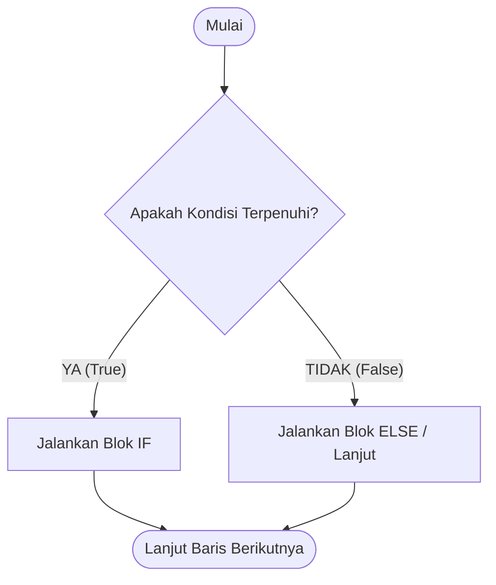
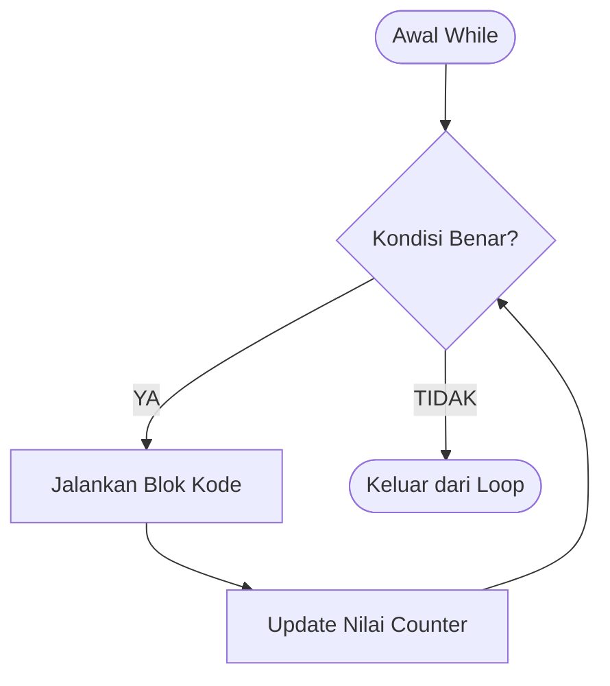

<div align="center">

# 🔀 2.4 Pemilihan dan Perulangan Sederhana
### Bab 2: Structured Programming · Logika Pengambilan Keputusan & Iterasi

[⬅️ Modul 2.3: Operator Aritmatika](03-Operator-Aritmatika-dan-Assignment.md) &nbsp;•&nbsp; [Overview Bab 2](Bab2-Overview.md) &nbsp;•&nbsp; [Masuk ke Bab 3: Program Control ➡️](../bab-03-program-control/Bab3-Overview.md)

---

</div>

## 🧠 Dua Pilar Terpenting Pemrograman

Sebuah program komputer akan sangat kaku jika hanya berjalan lurus dari atas ke bawah. Dua kemampuan utama yang membuat program terasa "cerdas" adalah:

1. **Pemilihan (*Decision Making / Branching*):** Kemampuan memilih jalur instruksi yang berbeda berdasarkan kondisi tertentu (menggunakan `if-else`).
2. **Perulangan (*Iteration / Looping*):** Kemampuan mengeksekusi sekumpulan instruksi yang sama berulang kali secara otomatis selama syarat masih terpenuhi (menggunakan `while`).

---

## 1️⃣ Pemilihan: Struktur `if - else`

Konstruksi `if-else` memungkinkan program menguji sebuah ekspresi logika. Jika kondisi bernilai **BENAR (True / bernilai bukan 0)**, blok kode di dalamnya akan dieksekusi.



### Sintaks Lengkap:

```c
if (/* kondisi 1 */) {
    // Dijalankan jika kondisi 1 BENAR
} else if (/* kondisi 2 */) {
    // Dijalankan jika kondisi 1 SALAH, tetapi kondisi 2 BENAR
} else {
    // Dijalankan jika SEMUA kondisi di atas SALAH
}
```

---

## ⚖️ Operator Relasional & Logika

### 1. Operator Relasional (Pembanding Nilai)

| Operator | Arti | Contoh | Hasil Uji |
|:---:|---|---|:---:|
| `==` | Sama dengan | `5 == 5` | **Benar (True)** |
| `!=` | Tidak sama dengan | `5 != 3` | **Benar (True)** |
| `>` | Lebih besar dari | `10 > 7` | **Benar (True)** |
| `<` | Lebih kecil dari | `4 < 2` | **Salah (False)** |
| `>=` | Lebih besar atau sama dengan | `5 >= 5` | **Benar (True)** |
| `<=` | Lebih kecil atau sama dengan | `3 <= 2` | **Salah (False)** |

> [!CAUTION]
> ### 🚨 Awas Tertukar: `==` vs `=`
> - `==` adalah **operator pembanding** (menguji apakah dua nilai sama).
> - `=` adalah **operator assignment** (memasukkan nilai ke variabel).
> 
> Menulis `if (nilai = 100)` di C tidak akan error, tetapi akan **selalu dianggap BENAR** karena nilai 100 dimasukkan ke variabel! Selalu gunakan `if (nilai == 100)`.

### 2. Operator Logika (Penggabung Kondisi)

| Simbol | Nama | Keterangan | Contoh |
|:---:|:---:|---|---|
| `&&` | **AND** (Dan) | Benar HANYA JIKA **kedua sisi** bernilai benar. | `(nilai >= 80) && (hadir >= 75)` |
| `\|\|` | **OR** (Atau) | Benar jika **salah satu atau kedua sisi** bernilai benar. | `(hari == 'S') \|\| (hari == 'M')` |
| `!` | **NOT** (Bukan) | Membalikkan nilai logika (Benar $\to$ Salah, Salah $\to$ Benar). | `!(umur < 17)` |

---

## 💻 Contoh Nyata: Sistem Penilaian Mahasiswa

Berikut program lengkap untuk mengonversi nilai angka menjadi predikat kelulusan:

```c
#include <stdio.h>

int main() {
    int nilai;

    printf("=============================\n");
    printf("  SISTEM PENENTU PREDIKAT   \n");
    printf("=============================\n");
    printf("Masukkan nilai ujian (0-100): ");
    scanf("%d", &nilai);

    if (nilai >= 85) {
        printf("Predikat: Amat Baik (Nilai A) 🎉\n");
    } else if (nilai >= 70) {
        printf("Predikat: Baik (Nilai B) 👍\n");
    } else if (nilai >= 55) {
        printf("Predikat: Cukup (Nilai C) 🙂\n");
    } else {
        printf("Predikat: Perlu Remedial (Nilai D/E) 💪 Tetap Semangat!\n");
    }

    return 0;
}
```

---

## 2️⃣ Perulangan Sederhana: Struktur `while`

Perulangan `while` terus menjalankan instruksinya selama kondisi yang diuji di dalam kurung bernilai **True**.



### 3 Unsur Wajib Perulangan:
1. **Inisialisasi Nilai Awal:** Menyiapkan variabel penghitung (counter).
2. **Kondisi Berhenti:** Batas kapan perulangan harus berakhir.
3. **Pembaruan Counter (Update):** Mengubah nilai counter (biasanya `i++` atau `i--`). Tanpa bagian ini, program akan terjebak **Infinite Loop**!

### Studi Kasus: Bebek Bersuara (Duck Quacker)

```c
#include <stdio.h>

int main() {
    int totalQuack;
    int i = 1; // 1. Inisialisasi

    printf("Berapa kali bebek ingin bersuara? ");
    scanf("%d", &totalQuack);

    printf("\nBebek bersuara: ");
    // 2. Kondisi perulangan
    while (i <= totalQuack) {
        printf("Quack! ");
        i++; // 3. Update counter (menambah nilai i setiap putaran)
    }
    printf("\n\nSelesai! Bebek sudah lelah bersuara.\n");

    return 0;
}
```

**Hasil Eksekusi:**
```text
Berapa kali bebek ingin bersuara? 4

Bebek bersuara: Quack! Quack! Quack! Quack! 

Selesai! Bebek sudah lelah bersuara.
```

> [!WARNING]
> ### 🛑 Apa itu Infinite Loop?
> Jika pada kode di atas baris `i++;` dihapus, maka nilai `i` akan selamanya bernilai `1`. Karena `1 <= 4` akan selalu bernilai BENAR selamanya, programmu tidak akan pernah berhenti mencetak `Quack!` sampai terminal dihentikan paksa (tekan `Ctrl + C` untuk mematikan program yang macet).

---

## 🥊 Tantangan & Mini Kuis

### Tebak Pola Output!
Perhatikan potongan kode `while` berikut:
```c
int counter = 2;
while (counter <= 10) {
    printf("%d ", counter);
    counter += 2;
}
```
Deret angka apakah yang akan dicetak di layar console?

<details>
<summary>🔍 <b>Klik untuk Buka Kunci Jawaban</b></summary>

**Output:** `2 4 6 8 10 `  
**Penjelasan:** Loop dimulai dari `counter = 2`, mencetak nilainya, lalu bertambah `+2` setiap putaran (`2 -> 4 -> 6 -> 8 -> 10`). Ketika `counter` menjadi `12`, kondisi `12 <= 10` bernilai SALAH, sehingga loop berhenti.
</details>

---

<div align="center">

### 🎓 Selamat! Kamu Telah Menuntaskan Seluruh Materi Bab 2!

[⬅️ Sebelumnya: 2.3 Operator Aritmatika](03-Operator-Aritmatika-dan-Assignment.md) &nbsp;&nbsp;|&nbsp;&nbsp; [📋 Daftar Materi Utama](../Daftar_Materi.md) &nbsp;&nbsp;|&nbsp;&nbsp; [Lanjut ke Bab 3: Program Control ➡️](../bab-03-program-control/Bab3-Overview.md)

</div>
