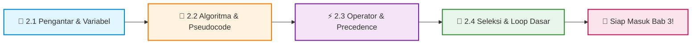

<div align="center">

# 📖 Bab 2: Structured Programming
### Praktikum Konsep Pemrograman · S1 Informatika UNS

[](#)
[](#)
[](#)

<br>

[📋 Kembali ke Daftar Materi Utama](../Daftar_Materi.md) &nbsp;•&nbsp; [Mulai Belajar Modul 2.1 ➡️](01-Pengantar-C-dan-Variabel.md)

---

</div>

## 🌟 Selamat Datang di Dunia Pemrograman C!

> *"A journey of a thousand miles begins with a single step."* — Lao Tzu

Bab 2 adalah **pondasi emas** perjalananmu sebagai seorang programmer. Di sini, kamu akan mentransformasi caramu berpikir: dari sekadar pengguna komputer (*user*) menjadi perancang logika di balik layar (*creator*). 

Kita akan memulai dari anatomi program C paling fundamental, seni merancang logika (algoritma & pseudocode), bermain dengan operator matematika, hingga membuat program cerdas yang bisa mengambil keputusan (`if-else`) dan mengulang tugas secara otomatis (`while`).

---

## 🗺️ Roadmap Pembelajaran Bab 2

Berikut adalah alur konsep yang akan kamu kuasai secara bertahap:



---

## 🎯 Capaian Pembelajaran

Setelah menuntaskan bab ini, kamu diharapkan mampu:

- [x] **Membedah Anatomi Program C:** Memahami fungsi `#include`, `main()`, format specifier, serta variabel & tipe data.
- [x] **Berpikir Komputasional:** Menyusun tahapan pemecahan masalah dari Bahasa Alami $\to$ Pseudocode $\to$ Source Code C yang executable.
- [x] **Menguasai Aritmatika & Tipe Data:** Menggunakan operator perhitungan, assignment, increment/decrement, serta menghindari *integer division bug*.
- [x] **Membuat Keputusan & Iterasi:** Mengimplementasikan percabangan logika dasar (`if-else`) dan perulangan (`while`) tanpa terjebak *infinite loop*.

---

## 📑 Modul Pembelajaran

Klik salah satu materi di bawah untuk mulai menjelajah:

| Modul | Topik & Link | Fokus Materi | Estimasi Waktu |
|:---:|:---|:---|:---:|
| **2.1** | [🚀 **Pengantar C, Variabel & Basic I/O**](01-Pengantar-C-dan-Variabel.md) | Struktur dasar `main()`, tipe data (`int`, `float`, `char`), `printf` & `scanf`. | ⏱️ 15 Menit |
| **2.2** | [🧠 **Algoritma, Pseudocode & Source Code**](02-Algoritma-Pseudocode-SourceCode.md) | Pola pikir problem solving, konversi algoritma ke kode C. | ⏱️ 15 Menit |
| **2.3** | [⚡ **Operator Aritmatika & Assignment**](03-Operator-Aritmatika-dan-Assignment.md) | Compound assignment, modulo, type casting, dan prioritas operator. | ⏱️ 20 Menit |
| **2.4** | [🔀 **Pemilihan & Perulangan Sederhana**](04-PemilihandanPerulanganSederhana.md) | Logika `if-else`, operator boolean (`&&`, `\|\|`, `!`), dan perulangan `while`. | ⏱️ 25 Menit |

---

## 🛠️ Lab Setup: Cara Menjalankan Kode C

Kamu bisa mencoba seluruh contoh kode di modul ini langsung di komputermu:

```bash
# 1. Buka terminal pada folder file C kamu, lalu compile:
gcc nama_program.c -o program

# 2. Jalankan executable:
./program          # Linux / macOS / Git Bash
program.exe        # Windows Command Prompt / PowerShell
```

> [!TIP]
> **Rekomendasi IDE/Editor:** Gunakan **Visual Studio Code** dengan ekstensi **C/C++ (by Microsoft)** dan **Code Runner**. Kamu cukup menekan tombol `Ctrl + Alt + N` (atau tombol Play di kanan atas) untuk langsung meng-compile dan menjalankan kode!

---

## 💡 Golden Rules untuk Mahasiswa Baru

> [!IMPORTANT]
> 1. **Jangan Copy-Paste:** Biasakan mengetik kode secara manual. *Muscle memory* jari-jemarimu sangat krusial dalam mempelajari sintaks bahasa C.
> 2. **Eksperimen Bebas:** Ubah angka, ganti format, buat programnya error dengan sengaja! Kamu akan belajar paling banyak dari memahami *kenapa* suatu error terjadi.
> 3. **Perhatikan Titik Koma (`;`):** 80% error pemula di bahasa C berasal dari tanda titik koma yang tertinggal atau tanda kurung kurawal `{ }` yang tidak tertutup.

---

<div align="center">

[⬅️ Kembali ke Daftar Materi Utama](../Daftar_Materi.md) &nbsp;&nbsp;|&nbsp;&nbsp; [Mulai Modul 2.1: Pengantar C & Variabel ➡️](01-Pengantar-C-dan-Variabel.md)

</div>
