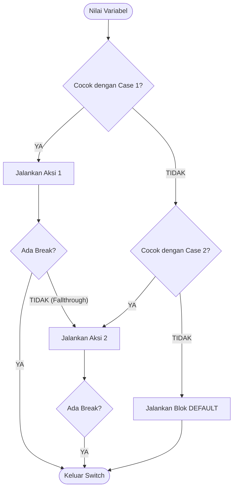

<div align="center">

# 🎛️ 3.1 Pemilihan dengan Switch
### Bab 3: Program Control · Percabangan Multi-Kondisi Elegan

[⬅️ Overview Bab 3](Bab3-Overview.md) &nbsp;•&nbsp; [📋 Daftar Materi](../Daftar_Materi.md) &nbsp;•&nbsp; [Modul 3.2: Perulangan For ➡️](02-Perulangan-Menggunakan-For-Statement.md)

---

</div>

## 💡 Mengapa Menggunakan `switch-case`?

Bayangkan kamu sedang membuat sistem menu kafe:
1. Kopi Espresso
2. Matcha Latte
3. Teh Tarik
4. Air Mineral
5. Keluar

Jika menggunakan rantai `if - else if - else if...`, kodemu akan dipenuhi tanda kurung dan perbandingan berulang-ulang yang melelahkan dibaca:
```c
if (pilihan == 1) { ... }
else if (pilihan == 2) { ... }
else if (pilihan == 3) { ... }
// Semakin banyak menu, semakin panjang dan berantakan!
```

Struktur **`switch-case`** hadir sebagai alternatif yang jauh lebih rapi, bersih, dan efisien untuk menangani pemilihan banyak opsi diskrit (*multi-way branch*).

---

## 🏛️ Sintaks Dasar `switch-case`

```c
switch (/* ekspresi integer / char */) {
    case konstanta_1:
        // Kode yang dijalankan jika ekspresi == konstanta_1
        break; // Menghentikan eksekusi dan keluar dari blok switch

    case konstanta_2:
        // Kode yang dijalankan jika ekspresi == konstanta_2
        break;

    default:
        // Kode opsional jika TIDAK ADA case yang cocok di atas
        break;
}
```



---

## ⚠️ Peran Krusial `break` & Perilaku *Fallthrough*

Apa yang terjadi jika kamu **lupa menulis `break`**? Program akan terus mengeksekusi case berikutnya di bawahnya secara otomatis, meskipun case berikutnya tidak cocok! Perilaku ini dinamakan **Fallthrough**.

### Contoh Kasus Lupa `break`:

```c
int angka = 1;

switch (angka) {
    case 1:
        printf("Satu\n");
    case 2:
        printf("Dua\n");
    case 3:
        printf("Tiga\n");
        break;
    default:
        printf("Lainnya\n");
}
```

**Output:**
```text
Satu
Dua
Tiga
```
> [!WARNING]
> Karena `case 1` tidak memiliki `break`, compiler akan "bocor" (*fallthrough*) ke `case 2` dan `case 3` hingga menemukan tanda `break`!

### Kapan *Fallthrough* Justru Sangat Berguna?
Kita bisa sengaja memanfaatkan fallthrough untuk **mengelompokkan beberapa opsi** yang membutuhkan perlakuan sama:

```c
char huruf = 'e';

switch (huruf) {
    case 'a':
    case 'i':
    case 'u':
    case 'e':
    case 'o':
        printf("'%c' adalah HURUF VOKAL!\n", huruf);
        break;
    default:
        printf("'%c' adalah HURUF KONSONAN / SIMBOL!\n", huruf);
        break;
}
```

---

## ⚡ Batasan & Kelemahan `switch-case`

> [!IMPORTANT]
> `switch-case` sangat cepat dan rapi, tetapi memiliki aturan ketat dalam bahasa C:
> 1. **Tipe Data Terbatas:** Hanya menerima ekspresi bertipe bilangan bulat (`int`, `short`, `long`) atau karakter (`char`). **TIDAK BISA** untuk `float`, `double`, atau string (`char[]`).
> 2. **Nilai Tetap (Konstanta):** Setiap label `case` harus berupa nilai konstan tetap (contoh: `case 5:`, `case 'X':`), **bukan variabel** atau rentang perbandingan seperti `case x > 5: ❌`.
> 3. Jika kamu membutuhkan rentang nilai (misal: nilai antara 80 s.d. 100), gunakan struktur `if - else if`.

---

## 💻 Studi Kasus Lengkap: Kalkulator Mini Sederhana

Berikut adalah program kalkulator interaktif yang memanfaatkan `switch-case` untuk memilih operator aritmatika:

```c
#include <stdio.h>

int main() {
    double a, b, hasil;
    char op;

    printf("==============================\n");
    printf("   KALKULATOR C TERMINAL      \n");
    printf("==============================\n");
    printf("Format input: [angka1] [operator: + - * /] [angka2]\n");
    printf("Contoh: 10 * 5\n\n");
    printf("Masukkan operasi: ");
    
    if (scanf("%lf %c %lf", &a, &op, &b) != 3) {
        printf("Format input salah!\n");
        return 1;
    }

    switch (op) {
        case '+':
            hasil = a + b;
            printf("Hasil: %.2lf + %.2lf = %.2lf\n", a, b, hasil);
            break;
        case '-':
            hasil = a - b;
            printf("Hasil: %.2lf - %.2lf = %.2lf\n", a, b, hasil);
            break;
        case '*':
            hasil = a * b;
            printf("Hasil: %.2lf * %.2lf = %.2lf\n", a, b, hasil);
            break;
        case '/':
            if (b != 0) {
                hasil = a / b;
                printf("Hasil: %.2lf / %.2lf = %.2lf\n", a, b, hasil);
            } else {
                printf("Error: Pembagian dengan angka 0 tidak terdefinisi!\n");
            }
            break;
        default:
            printf("Error: Operator '%c' tidak dikenali!\n", op);
            break;
    }

    return 0;
}
```

---

## 🥊 Tantangan & Mini Kuis

### Kuis 1: Analisis Kode
Perhatikan kode berikut:
```c
int nilai = 2;
switch (nilai) {
    case 1: printf("A ");
    case 2: printf("B ");
    case 3: printf("C ");
    default: printf("D ");
}
```
Apakah output yang akan tercetak di layar?

<details>
<summary>🔍 <b>Klik untuk Buka Kunci Jawaban</b></summary>

**Output:** `B C D `  
**Penjelasan:** Program mencocokkan `nilai == 2`, sehingga eksekusi dimulai dari `case 2` (mencetak `B `). Karena tidak ada satupun instruksi `break`, program mengalami *fallthrough* ke `case 3` (mencetak `C `) dan berlanjut ke `default` (mencetak `D `).
</details>

---

<div align="center">

[⬅️ Sebelumnya: Overview Bab 3](Bab3-Overview.md) &nbsp;&nbsp;|&nbsp;&nbsp; [Lanjut ke 3.2: Perulangan For ➡️](02-Perulangan-Menggunakan-For-Statement.md)

</div>
