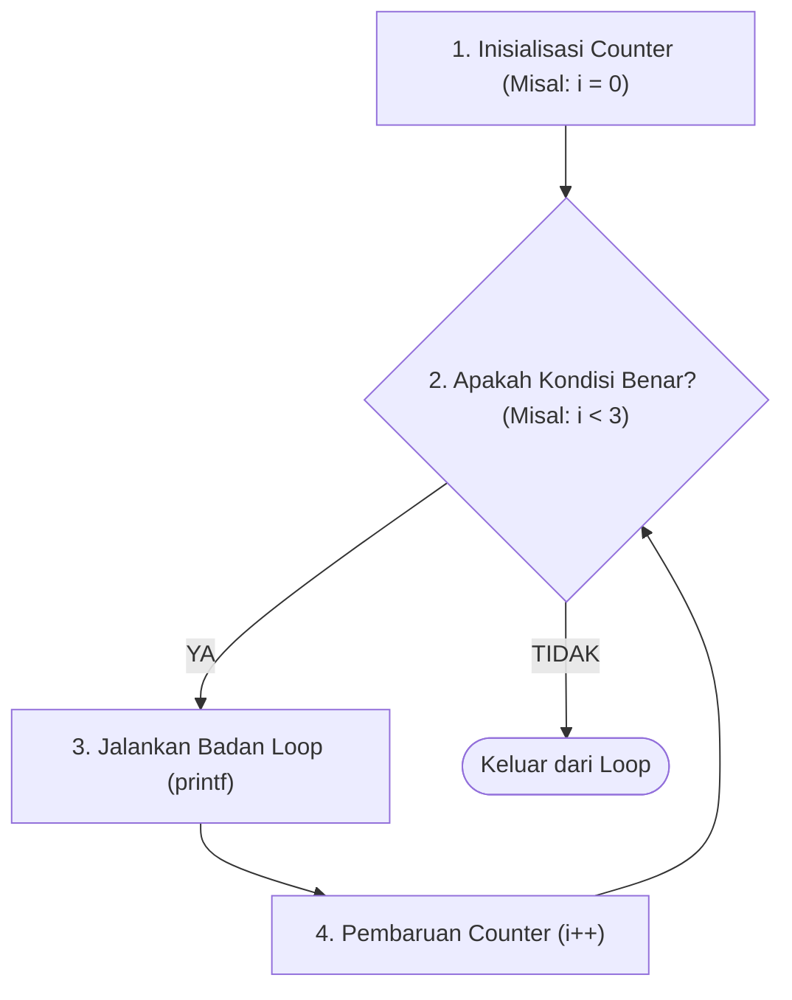

<div align="center">

# 🔁 3.2 Perulangan Menggunakan For Statement
### Bab 3: Program Control · Seni Counted Loop yang Presisi

[⬅️ Modul 3.1: Pemilihan Switch](01-Pemilihan-Dengan-Switch.md) &nbsp;•&nbsp; [Overview Bab 3](Bab3-Overview.md) &nbsp;•&nbsp; [Modul 3.3: Perulangan Do-While ➡️](03-Perulangan-Menggunakan-Do-While.md)

---

</div>

## 🎯 Mengapa Memilih `for` Loop?

Jika kamu sudah tahu pasti **berapa kali** sebuah instruksi harus diulang (misalnya: cetak angka 1 sampai 10, olah 50 data nilai mahasiswa, hitung mundur 5 detik), maka perulangan **`for`** adalah pilihan terbaik!

Dalam dunia pemrograman, perulangan jenis ini dikenal sebagai **Counted Loop**. Keunggulan utama `for` dibanding `while` adalah **keringkasan sintaks**: semua komponen kendali (inisialisasi, kondisi, pembaruan) dikemas rapi dalam satu baris header.

---

## 🏛️ Anatomi 3 Komponen `for`

```c
for ( /* 1. Inisialisasi */ ; /* 2. Kondisi Uji */ ; /* 4. Pembaruan (Update) */ ) {
    // 3. Badan Loop (Body Statement)
}
```



### Penjelasan Bagian per Bagian:

1. **Inisialisasi (`int i = 0`):** Dijalankan **hanya satu kali** di awal saat loop pertama kali dimulai. Berfungsi menyiapkan variabel penghitung (*loop counter*).
2. **Kondisi Uji (`i < 3`):** Dievaluasi **sebelum setiap iterasi**. Jika BENAR, kode di dalam kurung kurawal dijalankan. Jika SALAH, loop langsung berhenti.
3. **Badan Loop:** Instruksi program yang ingin kamu ulang.
4. **Pembaruan / Update (`i++`):** Dieksekusi **tepat setelah badan loop selesai dijalankan**, lalu alur kembali ke nomor 2 untuk mengecek kondisi ulang.

> [!NOTE]
> Pemisah antar komponen di dalam tanda kurung `for` **WAJIB menggunakan titik koma (`;`)**, bukan koma (`,`)!

---

## 📊 Tabel Pelacakan Eksekusi (Tracing Table)

Mari kita bedah apa yang terjadi di memori komputer pada kode berikut:
```c
for (int i = 1; i <= 3; i++) {
    printf("Iterasi ke-%d\n", i);
}
```

| Putaran | Nilai `i` Awal | Uji Kondisi (`i <= 3`) | Aksi Cetak Output | Update (`i++`) | Status Akhir |
|:---:|:---:|:---:|---|:---:|:---:|
| **1** | `1` | `1 <= 3` (**BENAR**) | `Iterasi ke-1` | `i` menjadi `2` | Lanjut |
| **2** | `2` | `2 <= 3` (**BENAR**) | `Iterasi ke-2` | `i` menjadi `3` | Lanjut |
| **3** | `3` | `3 <= 3` (**BENAR**) | `Iterasi ke-3` | `i` menjadi `4` | Lanjut |
| **4** | `4` | `4 <= 3` (**SALAH**) | *(Tidak dieksekusi)* | — | **Selesai!** |

---

## 🚀 Ragam Variasi Pola `for`

Perulangan `for` tidak melulu hanya `i++` dari kecil ke besar! Perhatikan variasi keren berikut:

### 1. Perulangan Mundur (Countdown / Decrement)
```c
// Hitung mundur peluncuran roket: 5, 4, 3, 2, 1, Meluncur!
for (int detik = 5; detik >= 1; detik--) {
    printf("%d... ", detik);
}
printf("🚀 MELUNCUR!\n");
```

### 2. Langkah Lebih dari Satu (Custom Step Size)
```c
// Mencetak bilangan genap dari 2 sampai 10
for (int genap = 2; genap <= 10; genap += 2) {
    printf("%d ", genap); // Output: 2 4 6 8 10
}
```

### 3. Kelipatan Perkalian
```c
// Deret pangkat: 1, 2, 4, 8, 16, 32, 64
for (int n = 1; n <= 64; n *= 2) {
    printf("%d ", n);
}
```

---

## ⚠️ Jebakan Batman pada `for` Loop

> [!CAUTION]
> ### 1. Jebakan Titik Koma Palsu di Ujung `for(...)`
> Ini salah satu kesalahan paling fatal bagi pemula:
> ```c
> for (int i = 0; i < 5; i++); // 🚨 AWAS! Ada titik koma di sini!
> {
>     printf("Hello!\n");
> }
> ```
> Titik koma di ujung `for` dianggap sebagai **perintah kosong (empty statement)**. Akibatnya, loop berputar 5 kali tanpa melakukan apa-apa, dan `"Hello!"` hanya tercetak **1 kali**!

> [!WARNING]
> ### 2. Awas *Off-by-One Error*
> Perhatikan tanda pertidaksamaanmu:
> - `for (int i = 0; i < 5; i++)` $\to$ Berputar **5 kali** (nilai: 0, 1, 2, 3, 4).
> - `for (int i = 0; i <= 5; i++)` $\to$ Berputar **6 kali** (nilai: 0, 1, 2, 3, 4, 5).
> - `for (int i = 1; i <= 5; i++)` $\to$ Berputar **5 kali** (nilai: 1, 2, 3, 4, 5).

---

## 🥊 Tantangan & Mini Kuis

### Kuis 1: Berapa Kali Pesan Tercetak?
Perhatikan kode berikut:
```c
for (int i = 10; i > 2; i -= 3) {
    printf("* ");
}
```
Berapa kali simbol `*` akan dicetak ke layar?

<details>
<summary>🔍 <b>Klik untuk Buka Kunci Jawaban</b></summary>

**Jawaban:** **3 kali**.  
**Nilai `i` per putaran:**
- Putaran 1: `i = 10` (10 > 2 -> Cetak `*`) $\to$ `i` menjadi 7
- Putaran 2: `i = 7` (7 > 2 -> Cetak `*`) $\to$ `i` menjadi 4
- Putaran 3: `i = 4` (4 > 2 -> Cetak `*`) $\to$ `i` menjadi 1
- Putaran 4: `i = 1` (1 > 2 -> SALAH! Loop berhenti)
</details>

---

<div align="center">

[⬅️ Sebelumnya: 3.1 Pemilihan dengan Switch](01-Pemilihan-Dengan-Switch.md) &nbsp;&nbsp;|&nbsp;&nbsp; [Lanjut ke 3.3: Perulangan Do-While ➡️](03-Perulangan-Menggunakan-Do-While.md)

</div>
