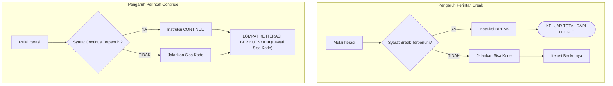

<div align="center">

# 🛑 3.4 Break dan Continue
### Bab 3: Program Control · Pengendali Interupsi Alur Iterasi

[⬅️ Modul 3.3: Perulangan Do-While](03-Perulangan-Menggunakan-Do-While.md) &nbsp;•&nbsp; [Overview Bab 3](Bab3-Overview.md) &nbsp;•&nbsp; [Masuk ke Bab 4: Function ➡️](../bab-04-function/Bab4-Overview.md)

---

</div>

## 💡 Rem Darurat & Tombol Lewati

Terkadang, sebuah perulangan tidak perlu berjalan sampai selesai hingga kondisi alaminya habis. Kamu mungkin ingin:
- Langsung berhenti mencari ketika barang yang dicari sudah ketemu.
- Melewati proses perhitungan untuk data tertentu yang rusak atau bernilai nol.

Bahasa C menyediakan dua instruksi kendali lompatan (*jump statement*):
1. **`break` (Rem Darurat):** Menghentikan loop saat itu juga dan melompat keluar dari seluruh perulangan.
2. **`continue` (Tombol Skip):** Mengabaikan sisa baris kode di iterasi saat ini, dan langsung melompat ke iterasi berikutnya.

---

## ⚔️ Perbandingan Visual: `break` vs `continue`



---

## 1️⃣ Perintah `break` (Hentikan Total)

`break` dapat digunakan di dalam perulangan `for`, `while`, `do-while`, serta blok percabangan `switch-case`.

### Studi Kasus: Pencarian Data (Linear Search)

Bayangkan kamu mencari angka `7` di dalam perulangan 1 sampai 100. Begitu angka `7` ditemukan, untuk apa kamu terus membuang tenaga CPU memeriksa angka 8 sampai 100?

```c
#include <stdio.h>

int main() {
    printf("Mulai mencari angka 7...\n");

    for (int i = 1; i <= 100; i++) {
        if (i == 7) {
            printf("🎯 Angka 7 BERHASIL DITEMUKAN pada iterasi ke-%d!\n", i);
            break; // Keluar dari loop sekarang juga!
        }
        printf("Memeriksa angka: %d...\n", i);
    }

    printf("Pencarian selesai!\n");
    return 0;
}
```

---

## 2️⃣ Perintah `continue` (Lewati Iterasi Ini)

`continue` tidak mematikan loop, melainkan hanya membatalkan sisa kode di bawahnya pada putaran itu, lalu langsung maju ke putaran selanjutnya.

### Contoh Kasus: Lewati Angka Kelipatan 3

```c
#include <stdio.h>

int main() {
    printf("Mencetak angka 1 s.d. 10 kecuali kelipatan 3:\n");

    for (int i = 1; i <= 10; i++) {
        if (i % 3 == 0) {
            continue; // Jangan cetak angka ini, langsung lanjut ke iterasi berikutnya!
        }
        printf("%d ", i);
    }
    printf("\n");

    return 0;
}
```

**Output:**
```text
Mencetak angka 1 s.d. 10 kecuali kelipatan 3:
1 2 4 5 7 8 10 
```
*(Perhatikan bahwa angka 3, 6, dan 9 dilewati dan tidak tercetak).*

---

## ⚠️ Jebakan Paling Berbahaya: `continue` dalam `while`

> [!CAUTION]
> Hati-hati menaruh instruksi `continue` di dalam perulangan `while`!  
> Perhatikan kode bermasalah ini:
> ```c
> int i = 1;
> while (i <= 5) {
>     if (i == 3) {
>         continue; // 🚨 BAHAYA BESAR: Infinite Loop Tersembunyi!
>     }
>     printf("%d ", i);
>     i++; // Pembaruan i terlewati saat i == 3!
> }
> ```
> **Mengapa macet?**  
> Saat `i = 3`, program mengeksekusi `continue`, sehingga baris `i++;` di bawahnya dilewati! Nilai `i` akan tetap `3` selamanya, dan program akan mengalami **Hang / Infinite Loop**!
>
> **Solusi yang benar:** Pastikan `i++` dijalankan *sebelum* `continue`, atau gunakan struktur `for` loop yang secara otomatis menangani update counter.

---

## 🥊 Tantangan & Mini Kuis

### Tebak Total Output:
Berapa banyak angka yang akan tercetak ke layar oleh kode berikut?
```c
for (int k = 1; k <= 8; k++) {
    if (k == 4) {
        continue;
    }
    if (k == 7) {
        break;
    }
    printf("%d ", k);
}
```

<details>
<summary>🔍 <b>Klik untuk Buka Kunci Jawaban</b></summary>

**Output yang tercetak:** `1 2 3 5 6 ` (Total: **5 angka**)  
**Penjelasan:**
- `k = 1, 2, 3` dicetak normal.
- `k = 4` dilewati karena `continue` (tidak dicetak).
- `k = 5, 6` dicetak normal.
- `k = 7` memicu `break`, sehingga loop berhenti total seketika (angka 7 dan 8 tidak pernah dicetak).
</details>

---

<div align="center">

### 🎓 Selamat! Kamu Telah Menuntaskan Seluruh Materi Bab 3!

[⬅️ Sebelumnya: 3.3 Perulangan Do-While](03-Perulangan-Menggunakan-Do-While.md) &nbsp;&nbsp;|&nbsp;&nbsp; [📋 Daftar Materi Utama](../Daftar_Materi.md) &nbsp;&nbsp;|&nbsp;&nbsp; [Lanjut ke Bab 4: C Function ➡️](../bab-04-function/Bab4-Overview.md)

</div>
