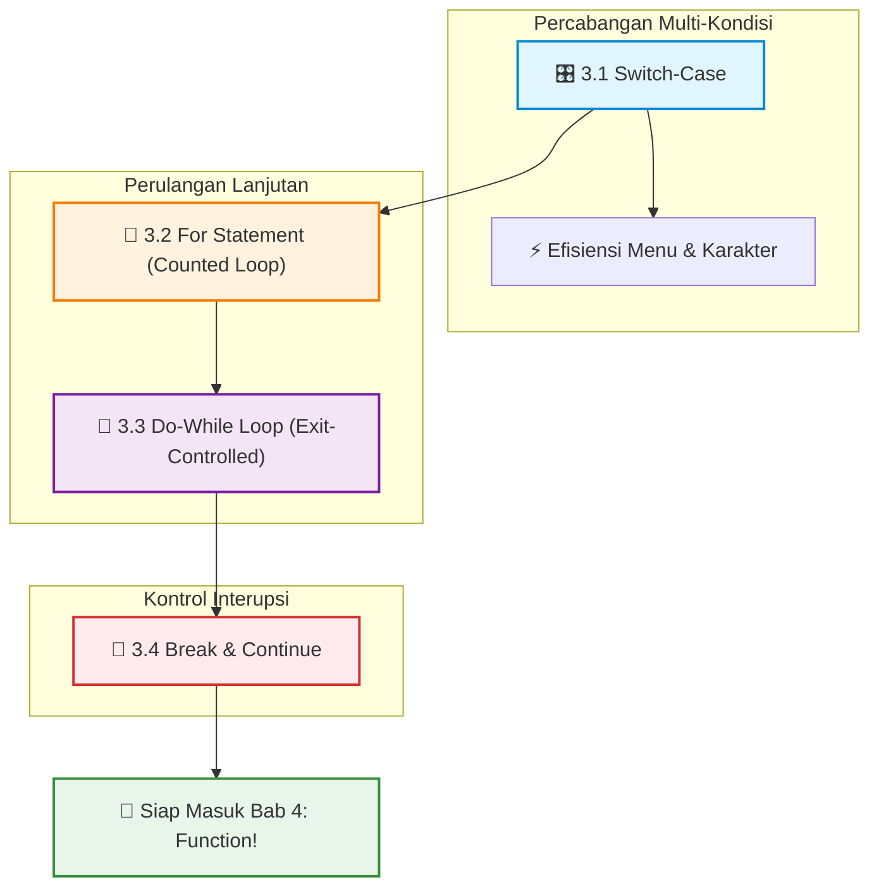

# 📖 Bab 3: Program Control
### Praktikum Konsep Pemrograman · S1 Informatika UNS

 

[📋 Kembali ke Daftar Materi Utama](../Daftar_Materi.md) &nbsp;•&nbsp; [Mulai Belajar Modul 3.1 ➡️](01-Pemilihan-Dengan-Switch.md)

---

## 🎮 Kendalikan Alur Programmu Seperti Pro!

Pada Bab 2, kamu sudah berkenalan dengan dasar percabangan `if-else` dan perulangan `while`. Namun dalam situasi nyata, program seringkali menghadapi skenario yang lebih kompleks:
- Menu pilihan ATM dengan 6 opsi berbeda.
- Menghitung perulangan data yang jumlahnya sudah pasti (misal: 100 data mahasiswa).
- Validasi input yang harus ditanyakan minimal satu kali sebelum dicek.
- Menghentikan proses pencarian di tengah jalan saat data sudah ditemukan.

Di Bab 3 ini, kamu akan menguasai **Program Control tingkat lanjut**: `switch-case`, *counted loop* `for`, `do-while`, serta pengendali loncatan `break` dan `continue`.

---

## 🗺️ Roadmap Pembelajaran Bab 3

---

## 🎯 Capaian Pembelajaran

Setelah menyelesaikan modul-modul di bab ini, kamu akan mampu:

- [x] **Menggunakan `switch-case` Secara Optimal:** Menulis menu multi-opsi yang bersih, rapi, dan memahami pentingnya kata kunci `break` serta `default`.
- [x] **Menguasai Counted Loop (`for`):** Memahami arsitektur tiga bagian (*inisialisasi; kondisi; update*) pada `for loop` serta variasinya (decrement, step size).
- [x] **Membedakan `while` vs `do-while`:** Memilih jenis loop yang tepat sesuai kebutuhan kasus (*entry-controlled* vs *exit-controlled*).
- [x] **Menginterupsi Alur Loop:** Menggunakan `break` untuk keluar dari loop seketika, dan `continue` untuk melompati iterasi tertentu tanpa merusak perulangan.

---

## 📑 Modul Pembelajaran

| Modul | Topik & Tautan | Pokok Bahasan Utama | Estimasi |
|:---:|:---|:---|:---:|
| **3.1** | [🎛️ **Pemilihan dengan Switch**](01-Pemilihan-Dengan-Switch.md) | Percabangan multi-pilihan, *fallthrough behavior*, perbandingan dengan `if-else`. | ⏱️ 20 Menit |
| **3.2** | [🔁 **Perulangan Menggunakan For Statement**](02-Perulangan-Menggunakan-For-Statement.md) | Counted loop, variabel counter, nested loop sederhana, dan pencegahan infinite loop. | ⏱️ 20 Menit |
| **3.3** | [🔄 **Perulangan Menggunakan Do-While**](03-Perulangan-Menggunakan-Do-While.md) | Karakteristik *post-condition test*, implementasi menu interaktif & validasi input. | ⏱️ 15 Menit |
| **3.4** | [🛑 **Break dan Continue**](04-Break-Dan-Continue.md) | Cara kerja terminasi dini (`break`) dan pelompatan langkah (`continue`). | ⏱️ 15 Menit |

---

## 🧭 Panduan Cepat: Kapan Menggunakan Apa?

| Struktur | Kapan Paling Tepat Digunakan? | Contoh Skenario Riil |
|---|---|---|
| **`if-else`** | Kondisi dinamis berbasis rentang nilai (`> 80`, `< 10`) atau kombinasi boolean majemuk (`&&`, `\|\|`). | Menentukan grade huruf dari skor nilai ujian. |
| **`switch-case`** | Memeriksa nilai konstan diskrit (angka bulat atau 1 karakter) dari satu variabel tunggal. | Menu pilihan kasir: `1. Kopi, 2. Teh, 3. Jus`. |
| **`for`** | Jumlah perulangan sudah diketahui secara pasti sejak awal (*Counted Loop*). | Mencetak data dari array index 0 sampai 99. |
| **`while`** | Perulangan yang berhenti berdasarkan kondisi boolean yang belum pasti jumlah perulangannya. | Membaca sensor selama suhu masih di bawah ambang batas. |
| **`do-while`** | Kode di dalam loop **wajib berjalan minimal satu kali** sebelum mengecek kondisi. | Menampilkan menu dan meminta input pengguna lagi jika salah. |

---

[⬅️ Kembali ke Bab 2: Structured Programming](../bab-02-structured-programming/Bab2-Overview.md) &nbsp;&nbsp;|&nbsp;&nbsp; [Mulai Modul 3.1: Pemilihan dengan Switch ➡️](01-Pemilihan-Dengan-Switch.md)

