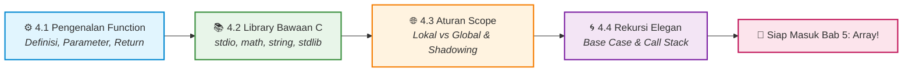

# 📖 Bab 4: C Function
### Praktikum Konsep Pemrograman · S1 Informatika UNS

 

[📋 Kembali ke Daftar Materi Utama](../Daftar_Materi.md) &nbsp;•&nbsp; [Mulai Belajar Modul 4.1 ➡️](01-Pengenalan-Function.md)

---

## 🧩 Seni Pemrograman Modular: Pecah & Kuasai!

Pernahkah kamu membayangkan membuat aplikasi berukuran ribuan baris, tetapi semuanya ditulis di dalam satu fungsi `main()` raksasa? Kode tersebut pasti akan menjadi mimpi buruk: sulit dibaca, penuh duplikasi, dan mustahil untuk di-debug!

Filosofi utama rekayasa perangkat lunak adalah **Divide and Conquer (Bagi dan Selesaikan)**. Di Bab 4 ini, kita akan mempelajari **Fungsi (Function)** — blok kode mandiri yang dapat dipanggil berkali-kali (*reusable*) untuk menyelesaikan tugas spesifik. 

Kita juga akan mengeksplorasi ribuan kemampuan bawaan dari **C Standard Library**, memahami batas wilayah variabel (**Scope**), dan membedah teknik memukau pemanggilan diri sendiri (**Rekursi**).

---

## 🗺️ Roadmap Pembelajaran Bab 4

---

## 🎯 Capaian Pembelajaran

Setelah menuntaskan Bab 4, praktikan diharapkan mampu:

- [x] **Merancang Fungsi Mandiri:** Mendeklarasikan prototipe (*function prototype*), mendefinisikan parameter masukan, dan mengembalikan nilai (*return value*) yang tepat.
- [x] **Memanfaatkan Standar Library C:** Menggunakan fungsi matematika canggih (`math.h`), manipulasi teks string (`string.h`), dan utilitas angka acak (`stdlib.h`).
- [x] **Memahami Arsitektur Scope:** Membedakan visibilitas variabel lokal vs global untuk mencegah bug tabrakan data (*side-effects*).
- [x] **Menyelesaikan Masalah dengan Rekursi:** Merancang fungsi rekursif dengan *base case* yang kokoh tanpa menyebabkan *stack overflow*.

---

## 📑 Modul Pembelajaran

| Modul | Topik & Tautan | Pokok Bahasan Utama | Estimasi |
|:---:|:---|:---|:---:|
| **4.1** | [⚙️ **Pengenalan Function**](01-Pengenalan-Function.md) | Deklarasi, definisi, parameter, argument, fungsi `void`, dan prinsip DRY. | ⏱️ 25 Menit |
| **4.2** | [📚 **Fungsi Library Bawaan C**](02-Fungsi-Library-C.md) | Bedah pustaka `<math.h>`, `<string.h>`, `<stdlib.h>`, dan `<stdio.h>`. | ⏱️ 25 Menit |
| **4.3** | [🌐 **Aturan Scope & Lifetime**](03-Aturan-Scope.md) | Local Scope, Global Scope, *block scope*, dan fenomena *variable shadowing*. | ⏱️ 15 Menit |
| **4.4** | [🌀 **Rekursi (Recursion)**](04-Rekursi.md) | Konsep fungsi memanggil diri sendiri, *base case*, visualisasi *call stack*. | ⏱️ 20 Menit |

---

## 💡 Manfaat Utama Menggunakan Function: Prinsip D.R.Y

> [!TIP]
> **D.R.Y = Don't Repeat Yourself!**
> 1. **Mencegah Duplikasi Kode:** Tulis satu fungsi sekali, panggil 100 kali di mana saja.
> 2. **Perbaikan Terpusat:** Jika ada bug atau perubahan rumus, kamu cukup memperbaikinya di dalam satu fungsi tersebut.
> 3. **Meningkatkan Keterbacaan:** Program menjadi seperti membaca daftar cerita (misal: `siapkanData()`, `hitungTotal()`, `cetakLaporan()`).

---

[⬅️ Kembali ke Bab 3: Program Control](../bab-03-program-control/Bab3-Overview.md) &nbsp;&nbsp;|&nbsp;&nbsp; [Mulai Modul 4.1: Pengenalan Function ➡️](01-Pengenalan-Function.md)

