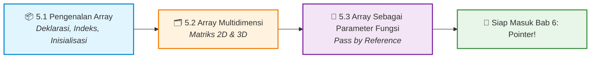

<div align="center">

&fontSize=40&fontColor=ffffff&animation=fadeIn&desc=Praktikum%20Konsep%20Pemrograman&descSize=15&descAlignY=70)

[](#)
[](#)
[](#)

<br>

[📋 Kembali ke Daftar Materi Utama](../Daftar_Materi.md) &nbsp;•&nbsp; [Mulai Belajar Modul 5.1 ➡️](01-Pengenalan-Array.md)

---

</div>

## 🧱 Dari Variabel Tunggal ke Koleksi Data!

Bayangkan kamu sedang membuat program untuk menyimpan nilai ujian **30 mahasiswa**. Jika menggunakan variabel biasa, kamu harus mendeklarasikan:

```c
int nilai1, nilai2, nilai3, ..., nilai30; // 😱 Sangat tidak efisien!
```

**Array** hadir sebagai solusi elegan. Cukup satu baris:

```c
int nilai[30]; // ✅ Menampung 30 nilai sekaligus!
```

Di Bab 5 ini, kamu akan menguasai salah satu struktur data paling fundamental dalam dunia pemrograman — **Array (Larik)**. Mulai dari array satu dimensi, matriks dua dimensi, hingga cara mengintegrasikannya dengan fungsi.

---

## 🗺️ Roadmap Pembelajaran Bab 5



---

## 🎯 Capaian Pembelajaran

Setelah menuntaskan Bab 5, praktikan diharapkan mampu:

- [x] **Mendeklarasikan & Menginisialisasi Array:** Memahami konsep kapasitas tetap, indeks berbasis nol, dan dua cara pengisian nilai.
- [x] **Mengakses & Memodifikasi Elemen:** Membaca dan mengubah nilai elemen array melalui indeks dengan aman (tanpa *out-of-bounds*).
- [x] **Menggunakan Array Multidimensi:** Merepresentasikan tabel data atau matriks matematika menggunakan array 2D dan mengaksesnya dengan nested loop.
- [x] **Mengintegrasikan Array dengan Fungsi:** Mengirimkan array ke fungsi (*pass by reference*) dan memahami perbedaannya dengan *pass by value* pada tipe data biasa.

---

## 📑 Modul Pembelajaran

| Modul | Topik & Tautan | Pokok Bahasan Utama | Estimasi |
|:---:|:---|:---|:---:|
| **5.1** | [📦 **Pengenalan Array**](01-Pengenalan-Array.md) | Deklarasi, inisialisasi langsung & satu-persatu, akses & modifikasi elemen, manajemen ukuran dinamis. | ⏱️ 25 Menit |
| **5.2** | [🗂️ **Array Multidimensi**](02-Array-Multidimensi.md) | Array 2D & 3D, representasi matriks, akses elemen dengan `[baris][kolom]`, *nested for loop*. | ⏱️ 20 Menit |
| **5.3** | [🔗 **Array Sebagai Parameter Fungsi**](03-Array-Sebagai-Parameter-Fungsi.md) | Cara passing array ke fungsi, perbedaan *pass by value* vs *pass by reference*, penggunaan `const`. | ⏱️ 20 Menit |

---

## 💡 Konsep Kunci yang Wajib Diingat

> [!IMPORTANT]
> **Indeks Array Selalu Dimulai dari 0, Bukan 1!**
> Ini adalah salah satu penyebab bug paling umum bagi programmer pemula.
> - Array `int nilai[5]` memiliki 5 elemen.
> - Elemen pertama adalah `nilai[0]`, elemen terakhir adalah `nilai[4]`.
> - Mengakses `nilai[5]` akan menyebabkan **Undefined Behavior / Crash**!

> [!TIP]
> **Array dan Loop adalah Pasangan Serasi!**
> Hampir semua operasi pada array (membaca, mengisi, mencari, menjumlahkan) dilakukan menggunakan perulangan `for`. Pastikan kamu sudah menguasai materi Bab 3 sebelum melanjutkan.

---

<div align="center">

[⬅️ Kembali ke Bab 4: Function](../bab-04-function/Bab4-Overview.md) &nbsp;&nbsp;|&nbsp;&nbsp; [Mulai Modul 5.1: Pengenalan Array ➡️](01-Pengenalan-Array.md)

</div>
