<div align="center">


### Praktikum Konsep Pemrograman · S1 Informatika UNS

[](#)
[](#)
[](#)
[](#)

<br>

[📋 Kembali ke Daftar Materi Utama](../Daftar_Materi.md) &nbsp;•&nbsp; [Mulai Belajar Modul 6.1 ➡️](01-Pengenalan-Pointer.md)

---

</div>

## 🧠 Selamat Datang di Dunia Memori!

Apakah kamu pernah bertanya-tanya, di mana komputer menyimpan semua variabel yang kamu buat? Jawabannya ada di **Random Access Memory (RAM)**. Setiap variabel ibarat sebuah kotak di dalam RAM, dan setiap kotak memiliki "alamat" unik.

Di Bab 6 ini, kamu akan mempelajari salah satu fitur paling legendaris (dan paling ditakuti) dalam bahasa C: **Pointer**. Pointer memungkinkan kita untuk melihat langsung ke dalam struktur memori komputer, mengakses data berdasarkan alamatnya, dan mengelola memori secara manual!

---

## ⚠️ Kesalahan Konsep yang Sering Terjadi

Sebelum mulai, kenali miskonsepsi umum yang bisa menghambat pemahamanmu:

1. **"Array di C otomatis pass by reference"** → Salah. C **selalu** *pass by value*. Yang terjadi pada array adalah *array decay* — nama array dikonversi ke pointer ke elemen pertama, dan pointer itulah yang disalin.

2. **"Pointer dan array adalah hal yang sama"** → Tidak tepat. Nama array tidak bisa diarahkan ulang (`arr++` adalah *compile error*), dan `sizeof(arr)` menghasilkan ukuran total array, bukan ukuran pointer.

3. **"`malloc` otomatis membebaskan memori saat program selesai"** → Memang benar OS mengklaim kembali memori saat proses berakhir, tetapi membiarkan `malloc` tanpa `free` dalam program yang berjalan lama menyebabkan RAM terus habis (*memory leak*). Biasakan selalu `free`.

4. **"Pointer yang sudah di-`free` aman digunakan lagi"** → Tidak. Ini disebut *use-after-free* dan merupakan *undefined behavior* yang sering menyebabkan crash atau celah keamanan.

5. **"`const int *p` artinya pointer tidak bisa diarahkan ulang"** → Terbalik! `const int *p` berarti **data** yang ditunjuk bersifat *read-only*. Pointer-nya sendiri masih bisa diarahkan ulang. Yang mengunci pointer adalah `int *const p`.

---

## 🔧 Prasyarat

Sebelum memulai Bab 6, pastikan kamu sudah memahami:

| Bab | Topik yang Dibutuhkan |
|-----|----------------------|
| **Bab 3: Fungsi** | *Scope* variabel, parameter fungsi, nilai kembalian |
| **Bab 5: Array** | Deklarasi array, akses elemen `arr[i]`, iterasi dengan loop |

---

## 🛠️ Peralatan yang Dibutuhkan

- **Compiler:** GCC (versi 7+) atau Clang
- **Cara kompilasi standar:**
  ```bash
  gcc -Wall -Wextra -std=c99 -g nama_file.c -o nama_program
  ```
- **Cara kompilasi dengan AddressSanitizer (deteksi bug memori):**
  ```bash
  gcc -Wall -Wextra -std=c99 -g -fsanitize=address,undefined nama_file.c -o nama_program
  ```
- **Cara menjalankan:** `./nama_program` (Linux/macOS) atau `nama_program.exe` (Windows)

---

## 🗺️ Roadmap Pembelajaran Bab 6

```mermaid
flowchart LR
    A["📍 6.1 Pengenalan Pointer\n<i>Memori, &amp;, *, const</i>"]
    B["🔢 6.2 Pointer dan Array\n<i>Aritmatika, arr[i]≡*(arr+i)</i>"]
    C["📬 6.3 Pass By Reference\n<i>swap, min-max, dangling ptr</i>"]
    D["🧱 6.4 DMA\n<i>malloc, calloc, realloc, free</i>"]
    E["🐛 6.5 Debugging\n<i>Bug umum, ASan, checklist</i>"]
    F["🏆 6.6 Latihan\n<i>Cheatsheet &amp; Mini-Project</i>"]

    A --> B --> C --> D --> E --> F

    style A fill:#e3f2fd,stroke:#1976d2,stroke-width:2px
    style B fill:#f3e5f5,stroke:#7b1fa2,stroke-width:2px
    style C fill:#fce4ec,stroke:#c2185b,stroke-width:2px
    style D fill:#e0f2f1,stroke:#00796b,stroke-width:2px
    style E fill:#fff3e0,stroke:#e65100,stroke-width:2px
    style F fill:#fff8e1,stroke:#ffa000,stroke-width:2px
```



---

## 🎯 Capaian Pembelajaran

Setelah menuntaskan Bab 6, praktikan diharapkan mampu:

- [x] **Memahami Konsep Alamat Memori:** Mengerti perbedaan antara nilai variabel dan alamat variabel, serta cara membaca dan mencetak alamat dengan `%p`.
- [x] **Mendeklarasikan & Menggunakan Pointer:** Mampu menggunakan operator *referencing* (`&`) dan *dereferencing* (`*`) dengan benar.
- [x] **Memahami Aritmatika Pointer:** Menjelaskan hubungan `arr[i]` ≡ `*(arr+i)` dan membuktikannya dengan output alamat.
- [x] **Menerapkan Simulasi Pass by Reference:** Menggunakan pointer sebagai parameter fungsi untuk memodifikasi variabel di luar *scope*, termasuk `swap` dan fungsi multi-output.
- [x] **Mengalokasikan Memori Dinamis (DMA):** Mampu menggunakan `malloc`, `calloc`, `realloc`, dan `free` dengan pola yang aman.
- [x] **Mencegah dan Mendeteksi Bug Memori:** Mengidentifikasi 9+ jenis bug pointer dan menggunakan AddressSanitizer untuk mendeteksinya.
- [x] **Menggunakan `const` dengan Pointer:** Membedakan tiga bentuk `const` pada pointer dan memilih yang tepat sesuai kebutuhan.

---

## 📑 Modul Pembelajaran

| Modul | Topik & Tautan | Pokok Bahasan Utama | Estimasi |
|:---:|:---|:---|:---:|
| **6.1** | [📍 **Pengenalan Pointer**](01-Pengenalan-Pointer.md) | Deklarasi, `&`, `*`, diagram memori, dua makna `*`, `const`, NULL pointer | ⏱️ 30 Menit |
| **6.2** | [🔢 **Pointer dan Array**](02-Pointer-dan-Array.md) | Nama array = alamat elemen pertama, aritmatika pointer, `arr[i]`≡`*(arr+i)`, pengiriman ke fungsi, string | ⏱️ 30 Menit |
| **6.3** | [📬 **Pass By Reference**](03-Pass-By-Reference.md) | `swap`, multi-output, dangling pointer, pointer dikirim by value | ⏱️ 25 Menit |
| **6.4** | [🧱 **Dynamic Memory Allocation**](04-Dynamic-Memory-Allocation.md) | Stack vs Heap, `malloc`/`calloc`/`realloc`/`free`, aturan emas DMA, array 2D dinamis | ⏱️ 35 Menit |
| **6.5** | [🐛 **Kesalahan Umum & Debugging**](05-Kesalahan-Umum-dan-Debugging.md) | 9 bug umum, ASan, Valgrind, GDB, checklist pre-submit | ⏱️ 20 Menit |
| **6.6** | [🏆 **Latihan dan Rangkuman**](06-Latihan-dan-Rangkuman.md) | Cheatsheet, 13 soal bertingkat (L1/L2/L3), kunci jawaban, mini-project | ⏱️ 60 Menit+ |

**Total estimasi: ±3.5 jam** (termasuk waktu mengerjakan latihan)

---

<div align="center">

[⬅️ Kembali ke Bab 5: Array](../bab-05-array/Bab5-Overview.md) &nbsp;&nbsp;|&nbsp;&nbsp; [Mulai Modul 6.1: Pengenalan Pointer ➡️](01-Pengenalan-Pointer.md)

</div>
